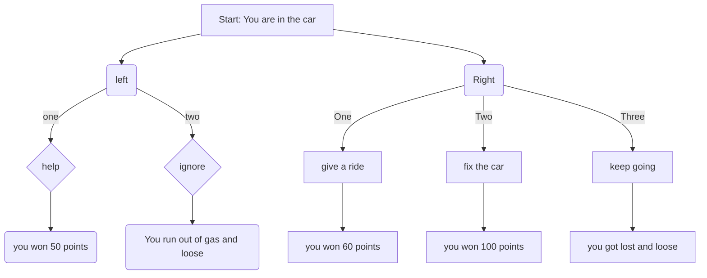

# Adventures in csci 1035

```bash
python -m src.game
```


```mermaid 
flowchart TD
    A[Start: You are in the car]
    A-->B(left)
    A --> C(Right)

    B-->|one| H{help}--> M(you won 50 points)
    B-->|two| I{ignore}--> N(You run out of gas and loose) 

    C -->|One| D[give a ride]--> P[you won 60 points]
    C -->|Two| E[fix the car]--> R[you won 100 points]
    C -->|Three| F[keep going]--> S[you got lost and loose]
```
  


