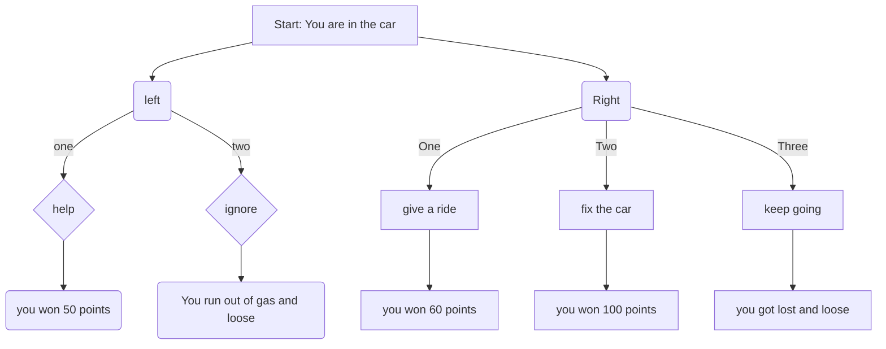
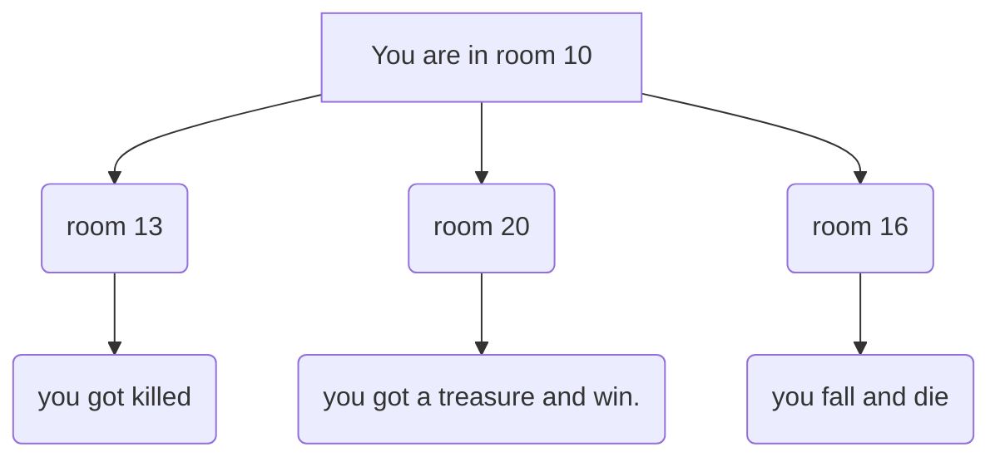

# Adventures in csci 1035

```bash
python -m src.game
```





```mermaid
flowchart TD
    A[Welcome on board. Let's go on a adventure!!!!!!! ]
    A--> B(Let's visit the space)
    A--> E(Let's visit the space)

    B--> C(Your companion runs away. You get killed and you lost)
    B-->D(You killed the monster with a laser and You won)

    E--> G(The spaceship broke down. You lost)
    E--> F(You jumped out and find a new one and treasure, you win)

    


      
  


